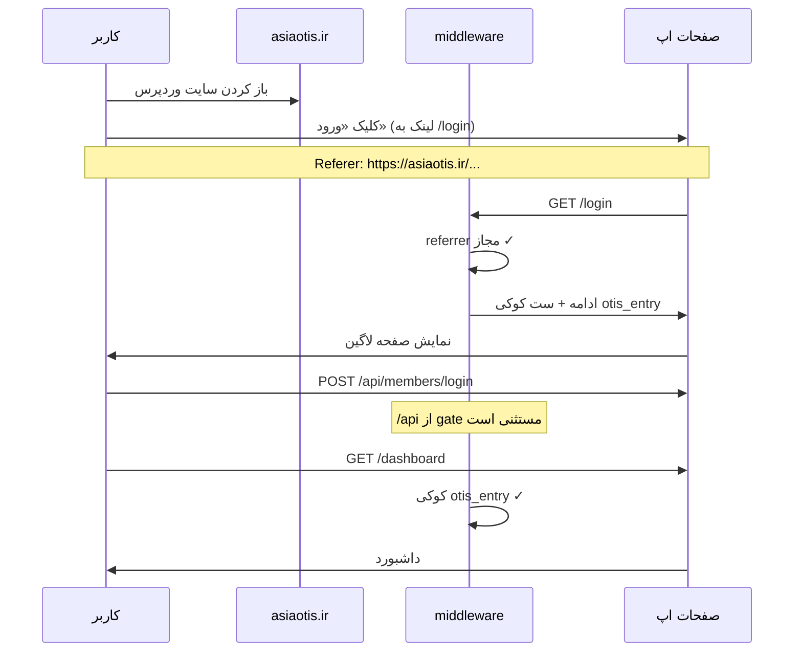
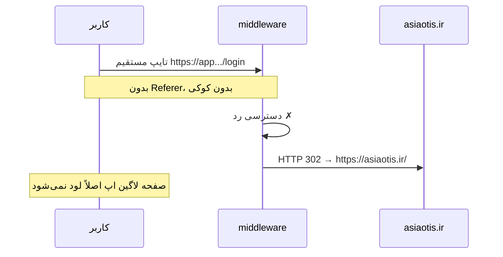

# درگاه ورود از سایت اصلی (Referrer Gate)

این سند توضیح می‌دهد **چرا** این قابلیت اضافه شده، **چطور** پیاده‌سازی شده، و **به چه روشی** کار می‌کند — مخصوصاً وقتی سایت معرفی، **وردپرس** (`https://asiaotis.ir/`) است و اپ OTIS روی **دامنه جدا** (یا زیردامنه) اجرا می‌شود.

---

## فهرست

1. [نیاز کارفرما](#نیاز-کارفرما)
2. [معماری کلی](#معماری-کلی)
3. [ایدهٔ طراحی](#ایدهٔ-طراحی)
4. [جریان کار (گام‌به‌گام)](#جریان-کار-گام‌به‌گام)
5. [محل پیاده‌سازی در کد](#محل-پیاده‌سازی-در-کد)
6. [الگوریتم تصمیم‌گیری](#الگوریتم-تصمیم‌گیری)ٰ
7. [کوکی ورود (`otis_entry`)](#کوکی-ورود-otis_entry)
8. [تنظیمات محیطی (Environment)](#تنظیمات-محیطی-environment)
9. [راه‌اندازی وردپرس](#راه‌اندازی-وردپرس)
10. [مسیرهایی که gate روی آن‌ها اجرا نمی‌شود](#مسیرهایی-که-gate-روی-آن‌ها-اجرا-نمی‌شود)
11. [جلوگیری از لوپ ریدایرکت](#جلوگیری-از-لوپ-ریدایرکت)
12. [حالت توسعه (Development)](#حالت-توسعه-development)
13. [محدودیت‌ها و امنیت](#محدودیت‌ها-و-امنیت)
14. [عیب‌یابی](#عیب‌یابی)
15. [چک‌لیست تست](#چک‌لیست-تست)

---

## نیاز کارفرما

| خواسته | توضیح |
|--------|--------|
| ورود فقط از سایت اصلی | کاربر باید از `https://asiaotis.ir/` (وردپرس) به اپ بیاید |
| بدون ورود مستقیم | اگر کسی آدرس اپ را مستقیم در مرورگر بزند (`/login`, `/dashboard`, …) **صفحه لاگین نباید** بالا بیاید |
| برگشت به سایت اصلی | در صورت دسترسی غیرمجاز، کاربر به `https://asiaotis.ir/` هدایت شود |
| بدون لوپ | پیاده‌سازی قبلی گاهی ریدایرکت بی‌نهایت ایجاد می‌کرد؛ نسخه فعلی این را کنترل می‌کند |

---

## معماری کلی

```
┌─────────────────────────┐         کلیک لینک          ┌──────────────────────────┐
│  asiaotis.ir            │  ─────────────────────────►  │  اپ OTIS (Next.js)       │
│  WordPress              │     + هدر Referer            │  مثلاً panel.example.ir  │
│  صفحات، منو، دکمه ورود  │                              │  /login, /dashboard, … │
└─────────────────────────┘                              └──────────────────────────┘
         ▲                                                            │
         │              ریدایرکت در صورت دسترسی مستقیم                 │
         └────────────────────────────────────────────────────────────┘
```

- **وردپرس**: فقط سایت معرفی و لینک «ورود به سامانه» است.
- **Next.js**: اپ واقعی؛ همهٔ درخواست‌های صفحه (به‌جز استثناها) از **`middleware.ts`** رد می‌شوند.
- **Gate**: در middleware بررسی می‌شود آیا کاربر مجاز است یا نه — **قبل از** رندر صفحه لاگین.

---

## ایدهٔ طراحی

دو مکانیزم روی هم قرار گرفته‌اند:

### ۱. بررسی Referrer (منبع ورود)

وقتی کاربر از وردپرس روی لینک اپ کلیک می‌کند، مرورگر معمولاً هدر **`Referer`** (یا گاهی **`Origin`**) را می‌فرستد؛ مثلاً:

```http
Referer: https://asiaotis.ir/some-page/
```

middleware دامنهٔ referrer را با لیست مجاز (`REFERRER_GATE_ALLOWED_URLS`) مقایسه می‌کند. اگر از `asiaotis.ir` یا `www.asiaotis.ir` باشد → **ورود اول مجاز**.

### ۲. کوکی نشست ورود (`otis_entry`)

بعد از اولین ورود معتبر، یک کوکی HttpOnly ست می‌شود. تا وقتی کوکی معتبر است، کاربر می‌تواند داخل اپ جابه‌جا شود **حتی اگر** درخواست بعدی referrer نداشته باشد (رفرش صفحه، لینک داخلی، و غیره).

بدون این کوکی، هر بار که referrer خالی باشد، دسترسی مستقیم محسوب می‌شود و **بلاک** می‌شود.

---

## جریان کار (گام‌به‌گام)

### سناریو A — ورود صحیح از وردپرس



### سناریو B — ورود مستقیم (غیرمجاز)



### سناریو C — بعد از ورود، حرکت داخل اپ

| درخواست | Referer | کوکی | نتیجه |
|---------|---------|------|--------|
| `/dashboard` از منوی اپ | همان دامنه اپ (same-origin) | دارد یا ندارد | ✅ مجاز |
| `/login` بعد از رفرش | ممکن است خالی | `otis_entry=1` | ✅ مجاز |
| `/login` تب جدید، آدرس مستقیم | خالی | ندارد | ❌ ریدایرکت به وردپرس |

---

## محل پیاده‌سازی در کد

| فایل | نقش |
|------|-----|
| [`lib/referrer-gate.ts`](lib/referrer-gate.ts) | منطق مشترک تصمیم‌گیری |
| [`lib/referrer-gate-server.ts`](lib/referrer-gate-server.ts) | **اجرای runtime روی سرور** (مهم برای production) |
| [`middleware.ts`](middleware.ts) | لایه اول + tenant + کوکی |
| [`app/(auth)/layout.tsx`](app/(auth)/layout.tsx) | gate قبل از لاگین/ثبت‌نام |
| [`app/(dashboard)/layout.tsx`](app/(dashboard)/layout.tsx) | gate قبل از داشبورد |
| [`app/(admin)/layout.tsx`](app/(admin)/layout.tsx) | gate قبل از پنل ادمین |
| [`app/page.tsx`](app/page.tsx) | gate روی `/` سپس ریدایرکت به `/login` |

**توجه:** فقط `middleware` کافی نیست — در Next.js متغیرهای env داخل middleware هنگام **`npm run build`** داخل باندل می‌شوند. اگر env را فقط بعد از build روی سرور گذاشته باشید، middleware ممکن است gate را «خاموش» ببیند. لایه **Server Layout** هر درخواست `process.env` را دوباره می‌خواند و در production درست کار می‌کند.

### ترتیب اجرا در `middleware`

```
درخواست HTTP
    │
    ▼
[۱] فیلتر آیکون‌های اندروید / assets نامعتبر → 404
    │
    ▼
[۲] Referrer Gate (اگر فعال باشد)
    │   ├─ bypass توسعه؟ → رد شدن از gate
    │   ├─ مسیر مستثنی؟ (/api, /_next, …) → رد شدن از gate
    │   ├─ مجاز؟ (کوکی / referrer / same-origin) → ادامه
    │   └─ غیرمجاز؟ → ریدایرکت به asiaotis.ir یا 403
    │
    ▼
[۳] تنظیم هدرهای tenant (x-tenant-id, …)
    │
    ▼
[۴] در صورت ورود معتبر از وردپرس → ست کوکی otis_entry
    │
    ▼
NextResponse.next() → صفحه یا API
```

---

## الگوریتم تصمیم‌گیری

تابع اصلی: `referrerGateAllowsRequest`

درخواست **مجاز** است اگر **یکی** از شرایط زیر برقرار باشد:

| # | شرط | توضیح |
|---|------|--------|
| 1 | کوکی `otis_entry=1` | قبلاً از وردپرس وارد شده |
| 2 | Referrer از دامنه‌های مجاز | مثلاً `https://asiaotis.ir/...` |
| 3 | Same-origin | referrer همان دامنهٔ اپ است (حرکت داخل سایت) |
| 4 | `REFERRER_GATE_ALLOW_DIRECT_NAVIGATION=true` | حالت اضطراری؛ تایپ مستقیم URL در مرورگر هم مجاز می‌شود (**در production خاموش بماند**) |

درخواست **رد** می‌شود وقتی:

- `REFERRER_GATE_ENABLED=true`
- حداقل یک URL در `REFERRER_GATE_ALLOWED_URLS` تعریف شده
- مسیر under gate است (نه `/api` و نه فایل استاتیک)
- bypass توسعه فعال نیست
- هیچ‌کدام از شرایط مجاز بالا برقرار نیست

### تطبیق دامنه و مسیر (`referrerMatchesAllowedRule`)

- `www.asiaotis.ir` و `asiaotis.ir` یکی در نظر گرفته می‌شوند (`normalizeHostname`).
- اگر قانون مجاز فقط `/` باشد (`https://asiaotis.ir/`) → **هر صفحه‌ای** از همان دامنه مجاز است (`/about`, `/blog/...`).
- اگر قانون مسیر خاص داشته باشد (`https://asiaotis.ir/portal`) → فقط همان مسیر و زیرمسیرها.

### تابع `hasAllowedExternalReferrer`

فقط برای **ست کردن کوکی** استفاده می‌شود: اگر referrer از وردپرس (یا same-origin) باشد، در پاسخ موفق کوکی `otis_entry` نوشته می‌شود.

---

## کوکی ورود (`otis_entry`)

| ویژگی | مقدار |
|--------|--------|
| نام | `otis_entry` |
| مقدار | `1` |
| `httpOnly` | `true` (جاوااسکریپت نمی‌خواند) |
| `sameSite` | `lax` |
| `secure` | در `production` فعال |
| `path` | `/` |
| مدت | `REFERRER_GATE_COOKIE_MAX_AGE` (پیش‌فرض: ۸۶۴۰۰ ثانیه = ۲۴ ساعت) |

**چرا لازم است؟**  
بعد از لاگین، بعضی درخواست‌ها referrer ندارند یا referrer فقط origin اپ است. کوکی نشست «ورود از درگاه مجاز» را نگه می‌دارد.

---

## تنظیمات محیطی (Environment)

| متغیر | الزامی | پیش‌فرض | توضیح |
|--------|--------|---------|--------|
| `REFERRER_GATE_ENABLED` | بله | — | `true` / `1` / `yes` برای فعال‌سازی |
| `REFERRER_GATE_ALLOWED_URLS` | بله | — | لیست جدا شده با کاما؛ مثال: `https://asiaotis.ir,https://www.asiaotis.ir` |
| `REFERRER_GATE_REDIRECT_URL` | توصیه‌شده | — | آدرس برگشت؛ معمولاً `https://asiaotis.ir/` |
| `REFERRER_GATE_ALLOW_DIRECT_NAVIGATION` | خیر | `false` | اگر `true` باشد، تایپ مستقیم URL در مرورگر هم مجاز می‌شود |
| `REFERRER_GATE_COOKIE_MAX_AGE` | خیر | `86400` | عمر کوکی به ثانیه |
| `REFERRER_GATE_BYPASS_LOCALHOST` | خیر | — | اگر `true` و host برابر localhost باشد، gate خاموش است |
| `REFERRER_GATE_ALLOWED_URL` | — | — | نام قدیمی؛ همان `ALLOWED_URLS` (تک URL) |

### نمونه production

```env
REFERRER_GATE_ENABLED=true
REFERRER_GATE_ALLOWED_URLS=https://asiaotis.ir,https://www.asiaotis.ir
REFERRER_GATE_REDIRECT_URL=https://asiaotis.ir/
REFERRER_GATE_ALLOW_DIRECT_NAVIGATION=false
REFERRER_GATE_COOKIE_MAX_AGE=86400
```

بعد از تغییر `.env` روی سرور، سرویس Next.js را **restart** کنید.

### ⚠️ چرا روی سرور env روشن بود ولی کار نکرد؟

| روش deploy | مشکل رایج | راه‌حل |
|------------|-----------|--------|
| Docker (`Dockerfile` فعلی) | `env_file` فقط **بعد از build** به container می‌رسد؛ middleware هنگام build بدون env ساخته شده | `docker compose build` با `build.args` (در `docker-compose.yml` هست) **یا** deploy نسخه جدید با Server Layout |
| `npm run build` لوکال + کپی `.next` | env روی سرور به build رفته نیست | روی **همان سرور** با `.env` کنار پروژه: `npm run build` سپس `npm start` |
| PM2 + تغییر فقط `.env` | بدون rebuild، middleware قدیمی می‌ماند | `npm run build` دوباره + restart |

**الان:** حتی بدون rebuild، layoutهای سرور با env جدید کار می‌کنند. برای اطمینان کامل، یک بار **rebuild + restart** انجام دهید.

---

## راه‌اندازی وردپرس

### لینک پیشنهادی

در منو، صفحه اصلی، یا دکمه Elementor:

```html
<a href="https://YOUR-APP-DOMAIN/login">ورود به سامانه</a>
```

`YOUR-APP-DOMAIN` را با دامنه واقعی deploy اپ عوض کنید.

### بایدها و نبایدها

| ✅ انجام دهید | ❌ انجام ندهید |
|--------------|----------------|
| لینک معمولی `<a href="...">` | `rel="noreferrer"` روی لینک |
| HTTPS روی هر دو سایت | ریدایرکت JS که referrer را از بین ببرد |
| تست از کلیک واقعی روی صفحه وردپرس | فرض اینکه بوکمارک `/login` کار کند |

### Referrer Policy در وردپرس

اگر افزونه امنیتی یا هدر **`Referrer-Policy: no-referrer`** روی کل سایت ست شده باشد، gate کار نمی‌کند. در Developer Tools → Network → اولین درخواست به اپ، هدر `Referer` باید دیده شود.

---

## مسیرهایی که gate روی آن‌ها اجرا نمی‌شود

این مسیرها **بدون** بررسی referrer عبور می‌کنند:

| مسیر | دلیل |
|------|------|
| `/api/*` | لاگین، پرداخت، callback درگاه — referrer ندارند |
| `/_next/*` | فایل‌های داخلی Next.js |
| `/favicon.ico` | آیکون |
| پسوندهای استاتیک | `.png`, `.css`, `.js`, `.woff2`, … |
| `_next/static`, `_next/image` | در `matcher` middleware مستثنی شده |

**نتیجه:** API لاگین (`POST /api/members/login`) از gate عبور می‌کند؛ ولی **صفحه** `/login` بدون کوکی/referrer مجاز نمایش داده نمی‌شود.

---

## جلوگیری از لوپ ریدایرکت

مشکل قبلی: `REFERRER_GATE_REDIRECT_URL` به همان دامنه اپ (`/login`) اشاره می‌کرد → ریدایرکت بی‌نهایت.

**راه‌حل فعلی** (`buildBlockedReferrerResponse`):

1. URL ریدایرکت parse می‌شود.
2. اگر **hostname** مقصد با hostname اپ یکی باشد → ریدایرکت **انجام نمی‌شود**؛ فقط `403 Forbidden`.
3. فقط ریدایرکت به دامنه **خارجی** (مثلاً `asiaotis.ir`) مجاز است.

```
REFERRER_GATE_REDIRECT_URL=https://asiaotis.ir/   ✅
REFERRER_GATE_REDIRECT_URL=/login                 ⚠️ همان host → 403 (بدون لوپ)
```

---

## حالت توسعه (Development)

| شرط | رفتار |
|------|--------|
| `REFERRER_GATE_ENABLED=true` + `npm run dev` | gate **فعال** (برای تست واقعی) |
| `REFERRER_GATE_BYPASS_IN_DEV=true` | gate در dev خاموش می‌شود |
| `REFERRER_GATE_BYPASS_LOCALHOST=true` + host=`localhost` | gate خاموش حتی در build production روی لوکال |

**توجه:** اگر gate کار نمی‌کند، اول `REFERRER_GATE_ENABLED=true` در `.env.local` را چک کنید، سپس سرور را restart کنید.

---

## محدودیت‌ها و امنیت

این مکانیزم یک **کنترل دسترسی سطح مرورگر** است، نه احراز هویت قوی:

| موضوع | واقعیت |
|--------|--------|
| هدف | جلوگیری از دسترسی عادی کاربران بدون ورود از سایت اصلی |
| دور زدن | کاربر حرفه‌ای می‌تواند کوکی را دستی بسازد؛ برای امنیت بالا به JWT/لاگین متکی باشید |
| Referrer | توسط مرورگر فرستاده می‌شود؛ قابل جعل در سطح client نیست ولی در سطح HTTP خام قابل دستکاری است |
| SEO / ربات | ربات‌ها referrer ندارند؛ معمولاً صفحات اپ index نمی‌شوند (مطابق خواسته) |

احراز هویت واقعی همچنان در **API لاگین + JWT/cookie توکن** انجام می‌شود؛ gate فقط «درِ ورود UI» است.

---

## عیب‌یابی

| علامت | احتمال علت | کار |
|--------|------------|-----|
| همیشه به وردپرس برمی‌گردد | `REFERRER_GATE_ENABLED=true` ولی لینک `noreferrer` دارد | لینک وردپرس را اصلاح کنید |
| از وردپرس هم بلاک می‌شود | `ALLOWED_URLS` اشتباه یا http/https فرق دارد | دامنه را دقیق در env بگذارید |
| لوپ ریدایرکت | `REDIRECT_URL` همان دامنه اپ است | فقط `https://asiaotis.ir/` |
| لوکال کار نمی‌کند | در dev gate خاموش است؛ در production env تست کنید | `build` + `start` |
| بعد از ۲۴ ساعت بیرون انداخته می‌شود | انقضای کوکی | `REFERRER_GATE_COOKIE_MAX_AGE` را زیاد کنید |
| پرداخت خراب شد | نادر؛ `/api` مستثنی است | مسیر callback را در Network بررسی کنید |

### بررسی در DevTools

1. از وردپرس کلیک کنید.
2. تب **Network** → اولین درخواست به دامنه اپ.
3. Request Headers → `Referer` باید شامل `asiaotis.ir` باشد.
4. Response Headers → `Set-Cookie: otis_entry=1` در همان پاسخ اول.

---

## چک‌لیست تست

- [ ] `REFERRER_GATE_ENABLED=true` روی سرور production
- [ ] restart سرویس بعد از تغییر env
- [ ] کلیک از `https://asiaotis.ir` → `/login` باز می‌شود
- [ ] کوکی `otis_entry` در Application → Cookies دیده می‌شود
- [ ] بعد از لاگین، `/dashboard` کار می‌کند
- [ ] تایپ مستقیم URL اپ در تب جدید → برگشت به `https://asiaotis.ir/`
- [ ] `REFERRER_GATE_REDIRECT_URL` به دامنه وردپرس است، نه `/login` اپ
- [ ] callback پرداخت (`/api/payment/callback`) بدون خطا

---

## خلاصه یک‌خطی

**فقط کسی که از سایت وردپرس (`asiaotis.ir`) با کلیک وارد اپ شده (یا کوکی نشست دارد) می‌تواند UI اپ را ببیند؛ ورود مستقیم به `/login` به جای لاگین، به سایت وردپرس برگردانده می‌شود.**

---

*آخرین به‌روزرسانی: هم‌خوان با `middleware.ts` در همین مخزن.*
